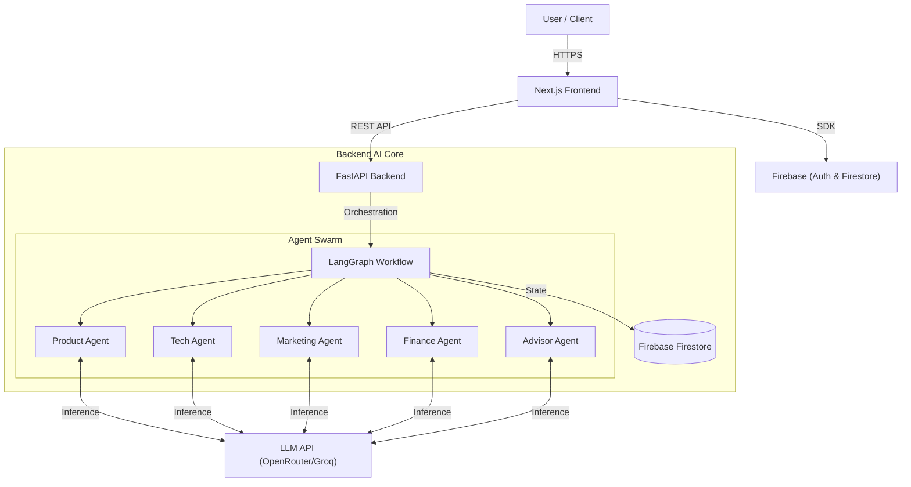

# 🚀 StartupOps

> **The AI-Powered Co-Founder Platform for Modern Startups**

**StartupOps** is an advanced, autonomous agentic platform designed to act as your comprehensive co-founding team. By leveraging a swarm of specialized AI agents, it helps founders plan, execute, and track their startup's journey from ideation to launch and beyond.


---

## ✨ Features

- **🤖 AI Agent Swarm**: A collaborative team of autonomous agents (Product, Tech, Marketing, Finance, Advisor) working in sync.
- **📊 Strategic Dashboard**: Real-time visualization of your startup's health, KPIs, and critical metrics.
- **🗺️ Intelligent Execution Plan**: Dynamic, AI-generated roadmaps broken down into actionable tasks.
- **🔗 Dependency Graph**: Interactive visualization of task dependencies and critical paths.
- **💬 Real-time Chat**: Context-aware chat interface to brainstorm and refine ideas with your AI co-founders.
- **🔐 Secure Authentication**: Enterprise-grade security using Firebase Authentication.
- **☁️ Cloud Native**: Built on Firebase Firestore for scalable, real-time data synchronization.

---

## 🏗️ Architecture

StartupOps utilizes a modern, decoupled architecture powered by **Next.js** on the frontend and **FastAPI** on the backend. The core intelligence is driven by **LangGraph**, orchestrating a swarm of Large Language Models (LLMs) to perform complex reasoning tasks.



### 🛠️ Tech Stack

#### **Frontend** (`/startup-ops`)
- **Framework**: [Next.js 16](https://nextjs.org/) (App Router)
- **Styling**: [Tailwind CSS v4](https://tailwindcss.com/)
- **UI Components**: [shadcn/ui](https://ui.shadcn.com/)
- **State Management**: [Zustand](https://github.com/pmndrs/zustand)
- **Animations**: [Framer Motion](https://www.framer.com/motion/) & [GSAP](https://gsap.com/)
- **Visualizations**: [React Flow](https://reactflow.dev/) (Graphs) & [Recharts](https://recharts.org/) (Charts)

#### **Backend** (`/backend`)
- **Framework**: [FastAPI](https://fastapi.tiangolo.com/)
- **Orchestration**: [LangGraph](https://langchain-ai.github.io/langgraph/) & [LangChain](https://python.langchain.com/)
- **Database**: [Firebase Firestore](https://firebase.google.com/docs/firestore) (NoSQL)
- **Auth**: [Firebase Authentication](https://firebase.google.com/docs/auth)
- **AI Models**: Llama 3.1, GPT-4o, Claude 3.5 (via OpenRouter/Groq)

---

## 🚀 Getting Started

Follow these steps to set up the project locally.

### Prerequisites
- **Node.js** (v18 or higher)
- **Python** (v3.10 or higher)
- **Git**

### 1. Clone the Repository
```bash
git clone https://github.com/aanandmodi/StartupOps.git
cd StartupOps
```

### 2. Backend Setup
Navigate to the backend directory and set up the Python environment.

```bash
cd backend
python -m venv venv

# Activate Virtual Environment
# Windows:
venv\Scripts\activate
# Mac/Linux:
source venv/bin/activate

# Install Dependencies
pip install -r requirements.txt
```

**Environment Variables**:
Create a `.env` file in the `backend/` directory:
```env
# AI Providers
OPENROUTER_API_KEY=your_openrouter_key
GROQ_API_KEY=your_groq_key

# Firebase (Service Account)
GOOGLE_APPLICATION_CREDENTIALS=service-account.json
# Or ensure service-account.json is in the backend root
```

**Run the Server**:
```bash
uvicorn app.main:app --reload
```
The backend API will be available at `http://localhost:8000`.

### 3. Frontend Setup
Open a new terminal and navigate to the frontend directory.

```bash
cd startup-ops
npm install
```

**Environment Variables**:
Create a `.env.local` file in the `startup-ops/` directory:
```env
NEXT_PUBLIC_API_URL=http://localhost:8000
NEXT_PUBLIC_FIREBASE_API_KEY=your_firebase_api_key
NEXT_PUBLIC_FIREBASE_AUTH_DOMAIN=your_project.firebaseapp.com
NEXT_PUBLIC_FIREBASE_PROJECT_ID=your_project_id
NEXT_PUBLIC_FIREBASE_STORAGE_BUCKET=your_project.appspot.com
NEXT_PUBLIC_FIREBASE_MESSAGING_SENDER_ID=your_sender_id
NEXT_PUBLIC_FIREBASE_APP_ID=your_app_id
```

**Run the Client**:
```bash
npm run dev
```
The application will be available at `http://localhost:3000`.

---

## 📂 Project Structure

```
StartupOps/
├── backend/                # FastAPI Backend
│   ├── app/
│   │   ├── agents/         # AI Agent Logic (Product, Tech, etc.)
│   │   ├── routers/        # API Routes
│   │   ├── models/         # Pydantic Models & Schemas
│   │   └── services/       # Business Logic & Firebase Integration
│   ├── requirements.txt
│   └── main.py
│
├── startup-ops/            # Next.js Frontend
│   ├── app/                # App Router Pages & Layouts
│   ├── components/         # Reusable UI Components
│   ├── lib/                # Utilities & Firebase Config
│   ├── store/              # Zustand State Stores
│   └── public/             # Static Assets
│
└── README.md               # You are here!
```

## 🤝 Contributing
Contributions are welcome! Please feel free to submit a Pull Request.

## 📄 License
This project is licensed under the MIT License.
